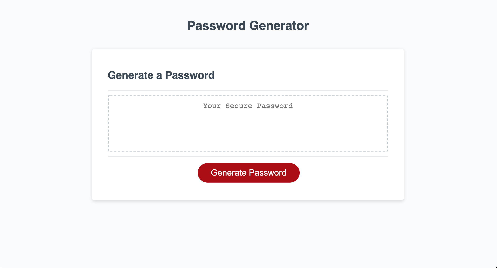
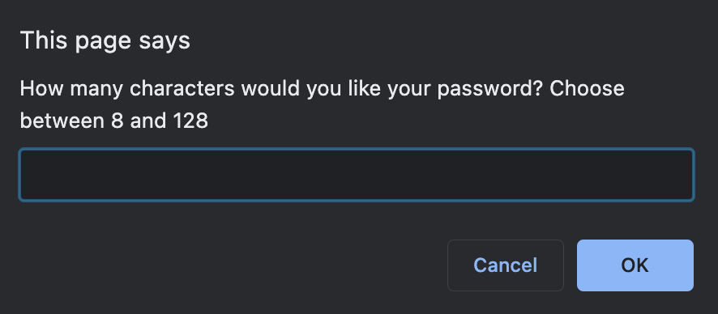
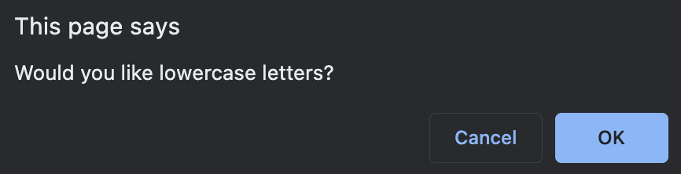
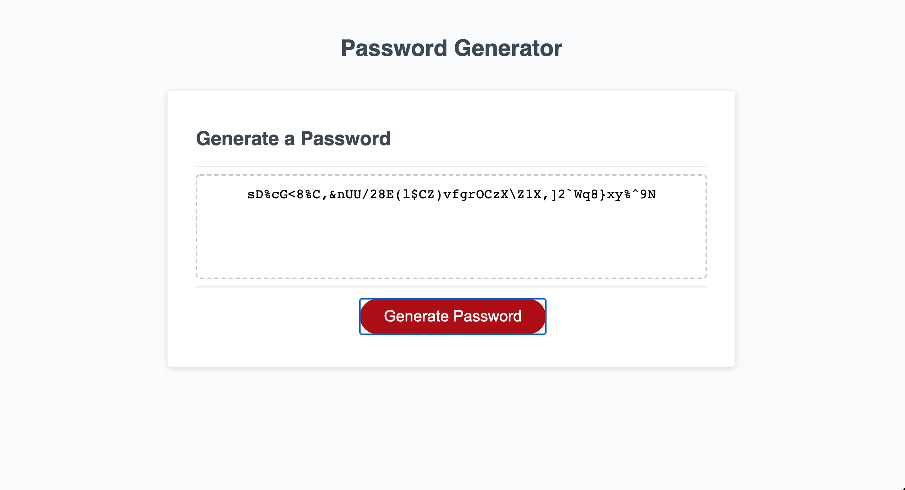

# Password Generator README
 Deployed URL : https://adambedingfield.github.io/password-generator/
 Github Repo URL : https://github.com/adambedingfield/password-generator

 # About
Password generator is a website that helps users create a randomized password through the use of special characters, numbers, upper and lowercase letters.

# Features
Clicking on the generate button will provide the user with a prompt of questions asking how long and what characters they wish to include in their password. They can choose a length between 8-128 and choose to include uppercase, lowercase, numbers, and special characters. Failure to input anything will notify the user requiring them to make correct inputs. Once the user makes selections a password is then produced in the text box.

# Languages used
HTML, CSS, and Javascript.
Bulk of the code is written in JS.

