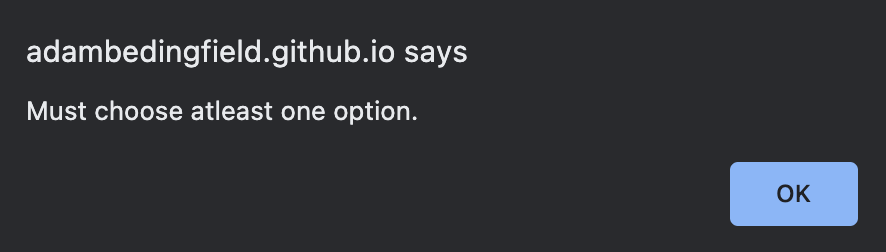

# Password Generator README
 Deployed URL : https://adambedingfield.github.io/password-generator/   
 
 Github Repo URL : https://github.com/adambedingfield/password-generator

 # About
Password generator is a website that helps users create a randomized password through the use of special characters, numbers, upper and lowercase letters.

Layout

# Features
Clicking on the generate button will provide the user with a prompt of questions asking how long and what characters they wish to include in their password.

Prompt asking user to input length.

One of four prompts asking user which characters they would like.

If user leaves inputs blank.

Generated Password based off user inputs.

# Languages used
HTML, CSS, and Javascript.  
Bulk of the code is written in JS.

